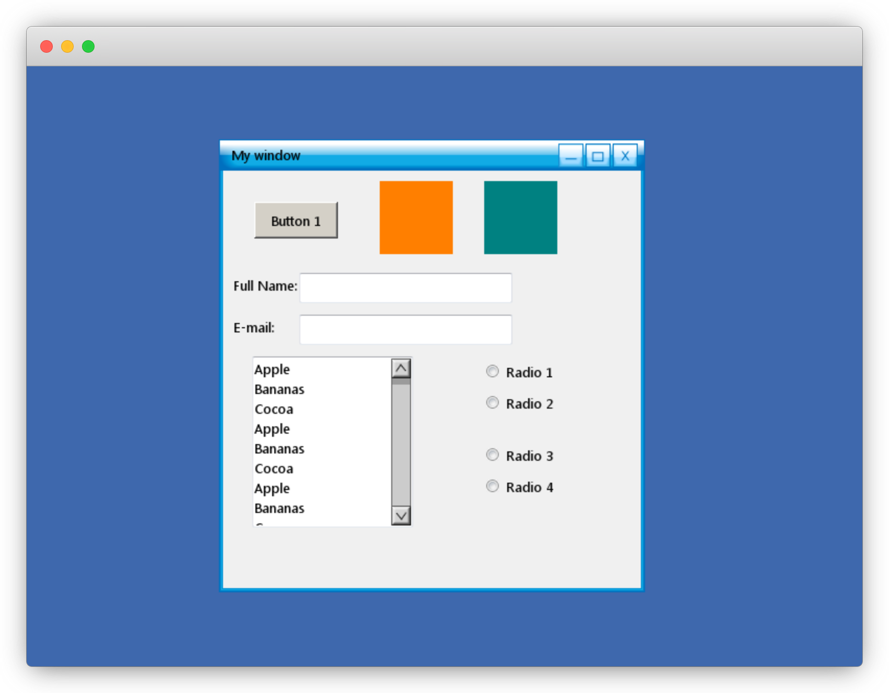

# C/C++ Widget Toolkit

## Build on macOS
Install cmake:
```shell
brew install cmake
```
Install dependencies:
```shell
brew install sdl2
brew install sdl2_image
brew install sdl2_ttf
```
```shell
cmake \ 
-DSDL2_INCLUDE_DIR=/usr/local/include/SDL2 \
-DSDL2_LIBRARY=/usr/local/lib/libSDL2.dylib \
-DSDL2_MAIN_LIBRARY=/usr/local/lib/libSDL2main.a \
-DSDL2_IMAGE_LIBRARY=/usr/local/lib/libSDL2_image.dylib \
-DSDL2_TTF_LIBRARY=/usr/local/lib/libSDL2_ttf.dylib \
-DSDL2_IMAGE_INCLUDE_DIR=/usr/local/include/SDL2 \
-DSDL2_TTF_INCLUDE_DIR=/usr/local/include/SDL2 \
-B./build
```
Build all targets:
```shell
cmake --build ./build
```
Build widgettoolkit only:
```shell
cmake --build ./build --target widgettoolkit
```